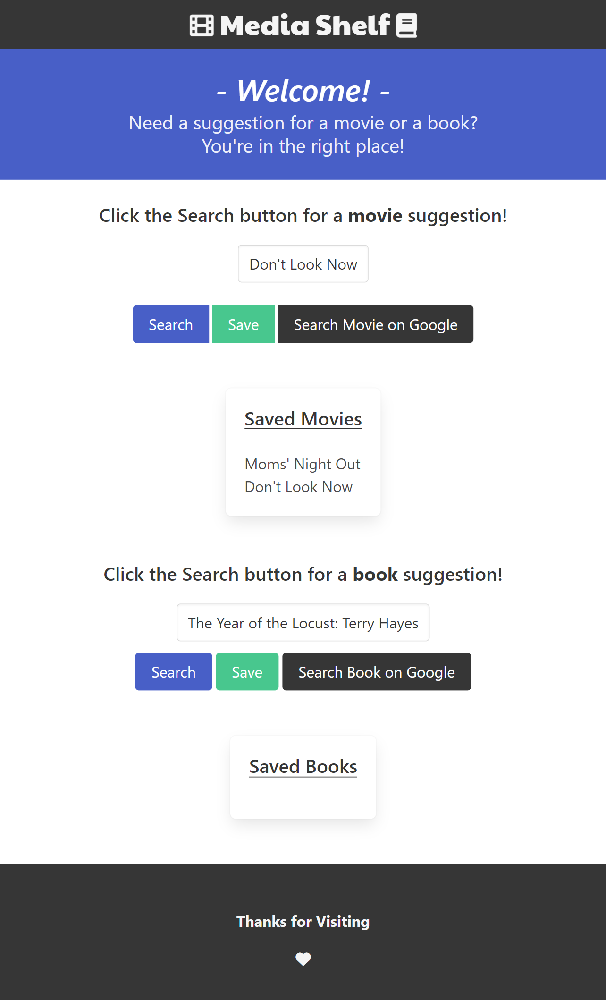

# Media Shelf
How much of your free time do you waste trying to find a movie or book? Too much. With Media Shelf, you can randomly generate a movie and/or a book to enjoy, or use as inspiration for your relaxation. We combined the power of Movie DB with Bookshelves to streamline your evenings. 

[Link to a Presentation on this App](https://docs.google.com/presentation/d/14NBL9ht6eOyNau7iS6GoiVfajBX8AGZ3ZSKo37LTqAM/edit#slide=id.p)

## This app combines:

-The Movie DB

-Bookshelves

## The goal of this app is to allow users to:
Generate random movie and book titles
Save books and movies that are of interest to them
Search for the titles using Google for more information

## Envisioned Use:
A starting point for deciding what to do on a quiet night at home

{Link to GitHub Pages}(https://easmsm.github.io/movie_finder/)
{Link to GitHub Repository}(https://github.com/easmsm/movie_finder)

### Resources:
{Bulma CSS Framework}(https://bulma.io/)
{Bookshelves API}(https://bookshelves.p.rapidapi.com/books)
{The Movie DB API}(https://api.themoviedb.org/3/movie/top_rated?api_key=)